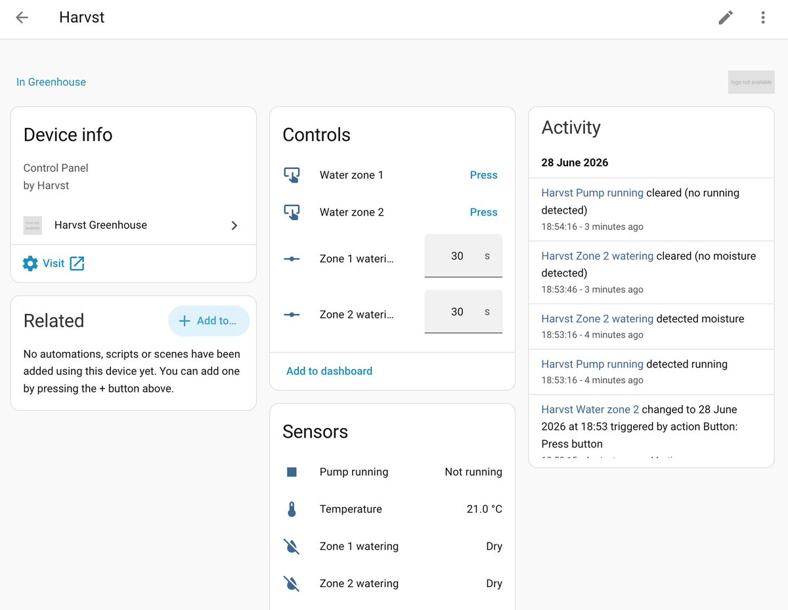

# Harvst Greenhouse — Home Assistant integration

[](https://github.com/martinwoodward/haharvst/actions/workflows/ci.yaml)
[](https://hacs.xyz)

A custom [Home Assistant](https://www.home-assistant.io/) integration for the
**Harvst** greenhouse watering control panel. It connects to the panel over your
local network and lets you:

- 🌡️ **Track the greenhouse temperature** (the wired "silver bullet" probe).
- 💧 **See when the watering zones are running.**
- 🚿 **Trigger each zone for a number of seconds** from a button, a service, or
  an automation.

It talks to the panel locally — no cloud account required.

> The auxiliary outputs (Aux 1/2/3) and the panel's WiFi setup are intentionally
> not exposed by this integration.



## Entities

| Entity | Type | Description |
| ------ | ---- | ----------- |
| `sensor.harvst_greenhouse_temperature` | Sensor | Wired temperature probe (°C). |
| `sensor.harvst_greenhouse_average_temperature` | Sensor | Rolling average temperature (disabled by default). |
| `binary_sensor.harvst_greenhouse_pump_running` | Binary sensor | `on` while the pump is running (any zone). |
| `binary_sensor.harvst_greenhouse_zone_1_watering` | Binary sensor | `on` while zone 1 is watering. |
| `binary_sensor.harvst_greenhouse_zone_2_watering` | Binary sensor | `on` while zone 2 is watering. |
| `number.harvst_greenhouse_zone_1_watering_duration` | Number | Duration (seconds) used by the zone 1 button. |
| `number.harvst_greenhouse_zone_2_watering_duration` | Number | Duration (seconds) used by the zone 2 button. |
| `button.harvst_greenhouse_water_zone_1` | Button | Water zone 1 for the configured duration. |
| `button.harvst_greenhouse_water_zone_2` | Button | Water zone 2 for the configured duration. |

## Service

### `harvst.water_zone`

Run a zone for an exact number of seconds.

| Field | Required | Description |
| ----- | -------- | ----------- |
| `zone` | yes | Zone to run (`1` or `2`). |
| `seconds` | yes | How long to run the pump (1–3600). |

```yaml
service: harvst.water_zone
data:
  zone: 1
  seconds: 45
```

Example automation — water zone 1 for 60s when it gets hot:

```yaml
automation:
  - alias: Water when hot
    trigger:
      - platform: numeric_state
        entity_id: sensor.harvst_greenhouse_temperature
        above: 28
    action:
      - service: harvst.water_zone
        data:
          zone: 1
          seconds: 60
```

## Installation

### HACS (recommended)

1. Make sure [HACS](https://hacs.xyz) is installed.
2. In Home Assistant go to **HACS → Integrations**.
3. Open the **⋮** menu (top right) and choose **Custom repositories**.
4. Add the repository URL `https://github.com/martinwoodward/haharvst` and select
   category **Integration**, then click **Add**.
5. Search for **Harvst Greenhouse** in HACS and click **Download**.
6. **Restart Home Assistant.**

[](https://my.home-assistant.io/redirect/hacs_repository/?owner=martinwoodward&repository=haharvst&category=integration)

### Manual

1. Copy the `custom_components/harvst` folder into your Home Assistant
   `config/custom_components/` directory.
2. Restart Home Assistant.

## Configuration

After installation, add the integration from the UI:

1. Go to **Settings → Devices & Services → Add Integration**.
2. Search for **Harvst Greenhouse**.
3. Enter the **host or IP address** of your control panel (for example
   `192.168.2.172`). The address is fully configurable, so set a static DHCP
   lease for the panel if you can.

[](https://my.home-assistant.io/redirect/config_flow_start/?domain=harvst)

You can adjust the polling interval later via the integration's **Configure**
button (default: 30 seconds).

## How it works (reverse-engineered API)

The Harvst control panel is an ESP-based device serving a small web UI. This
integration uses the same endpoints the UI does:

- **`GET /events`** — a Server-Sent-Events stream. Roughly once a second the
  panel emits a `new_readings` event whose `data:` line is JSON, e.g.:

  ```json
  {"te":22,"teAve":14.66,"ti":-13,"ta":-13,"h":-13,"cc":100}
  ```

  - `te` — wired temperature in °C (`-13` means the sensor is absent).
  - `teAve` — rolling average temperature.
  - `cc` — pump current in mA. It sits around `100` when idle and goes strongly
    negative (~`-4000`) while a pump runs, which is how watering is detected. On
    the exact reading where the pump turns on/off a `pump_state` (1/0) field is
    also included.

- **`GET /control?device=pump&state=on&zone=<n>&time=<seconds>`** — runs the
  pump on zone `n` (1 or 2) for `seconds` seconds.

- **`GET /settings`** — used once to read the panel's device id for a stable
  unique id.

### Limitations

- The panel reports a single pump state, not which valve/zone is open. Per-zone
  watering sensors therefore reflect zones triggered **through Home Assistant**.
  Watering started by the panel's own timers shows on the global
  *Pump running* sensor.
- If the panel's **Water supplied by** setting is *Mains / own system*, pump
  current detection is disabled on the device, so the watering sensors may not
  update.

## Development

```bash
pip install -r requirements_test.txt
pytest
ruff check custom_components tests
```

CI runs linting, Home Assistant `hassfest`, HACS validation and the test suite
on every push and pull request. When CI passes on `main`, a GitHub release is
published automatically using the version in
`custom_components/harvst/manifest.json`.

## License

[MIT](LICENSE) © Martin Woodward
